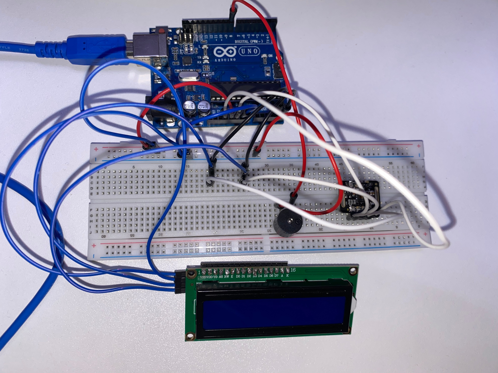
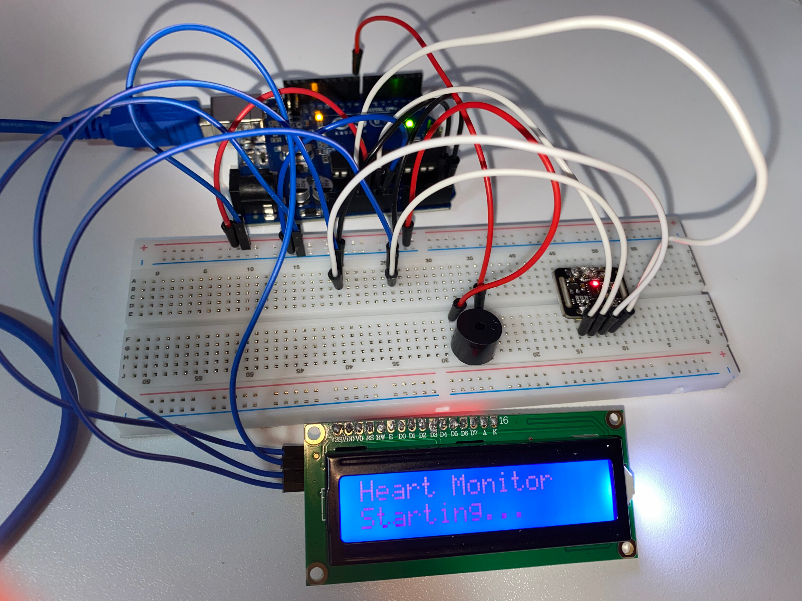
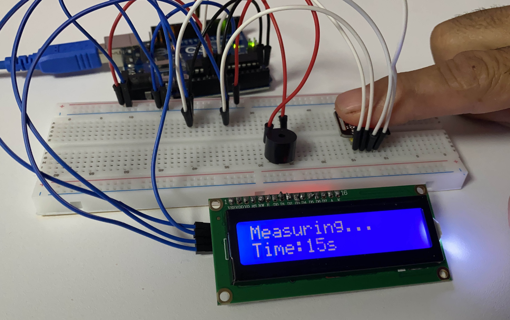
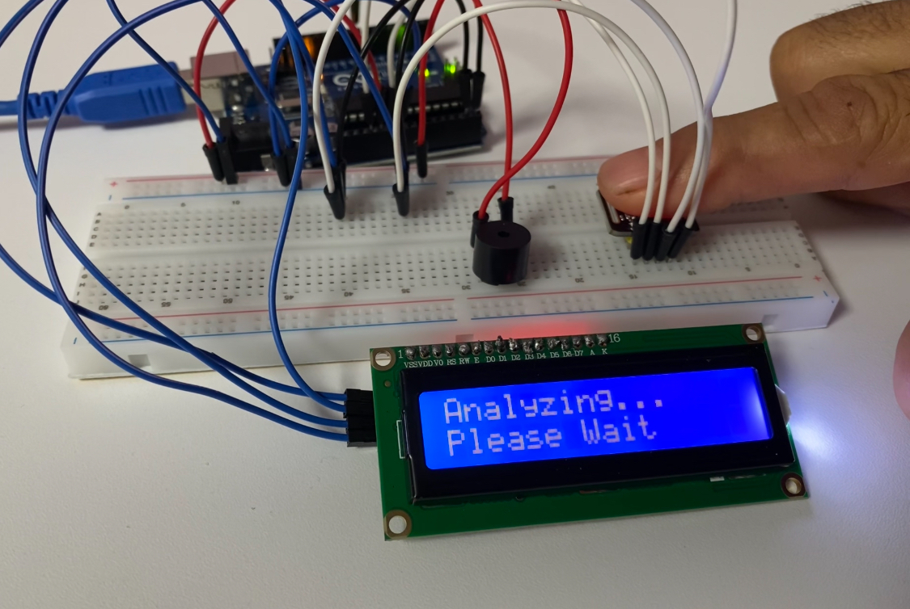
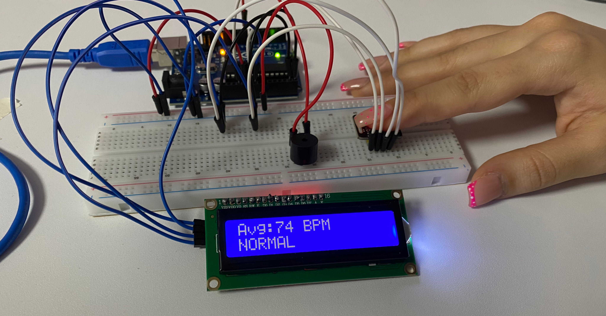
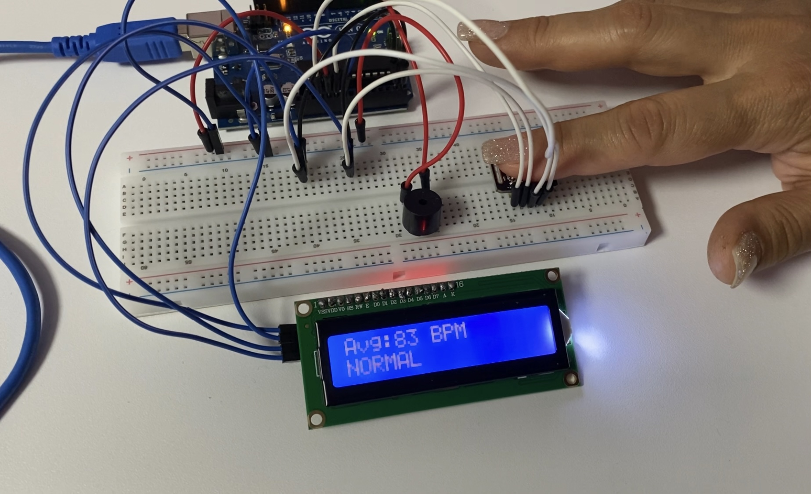

# Arduino Heart Rate Monitor❤️

> A real-time heart rate monitoring prototype using **Arduino UNO** and the **MAX30102 PPG sensor**.

<br>

## Overview

This project is an **Arduino-based heart rate monitoring prototype** developed using the **Arduino UNO** and the **MAX30102 optical pulse sensor**.

The system measures pulse signals using **photoplethysmography (PPG)**, calculates heart rate in **beats per minute (BPM)**, and displays the average measurement on a **16×2 I2C LCD**.

Based on **predefined BPM thresholds**, the measured heart rate is classified as **NORMAL**, **BRADYCARDIA**, or **TACHYCARDIA**. An audible **buzzer** provides feedback when the measured value falls outside the predefined normal range.

The prototype is designed as an **educational biomedical engineering project** to demonstrate the integration of **biosensors, microcontrollers, real-time signal acquisition, user feedback, and basic heart-rate classification**.

<br>

## 📸 Project Media

### 🧩 Hardware Setup



The complete prototype, including the **Arduino UNO, MAX30102 pulse sensor, 16×2 I2C LCD, buzzer, breadboard, and connecting wires**.

### ⚙️ System Initialization



The system initializes the heart-rate monitoring hardware and prepares the sensor for measurement.

### ❤️ Real-Time Measurement



During the measurement phase, the system continuously acquires pulse data while displaying the **remaining measurement time** on the LCD.

### 🔎 Data Analysis



After the **20-second measurement window**, the collected BPM data is processed to calculate the **average heart rate**.

### 📊 Normal Heart Rate Results





Example measurements classified as **NORMAL** according to the predefined BPM thresholds implemented in the program.

### 🎥 Demonstration Videos

#### Bradycardia Detection

[▶️ Watch the Bradycardia Detection Demo](media/videos/bradycardia-detection.mp4)

Demonstration of a low heart-rate measurement resulting in a **`BRADYCARDIA`** classification and an audible **buzzer alert**.

#### Full Measurement Cycle

[▶️ Watch the Full Measurement Cycle](media/videos/full-measurement-cycle.mp4)

Demonstration of the measurement workflow, from **system initialization and finger detection** to **BPM calculation, classification, and test reset**.

#### No Reading Handling

[▶️ Watch the No Reading Demo](media/videos/no-reading-handling.mp4)

Demonstration of the system response when **no valid heart-rate measurement is obtained**.

<br>

## ✨ Features

*  **Real-Time Heart Rate Monitoring** using the MAX30102 optical pulse sensor
*  **BPM Calculation** from detected pulse intervals
*  **Average BPM Calculation** over a 20-second measurement window
*  **16×2 I2C LCD Display** for real-time system status and measurement results
*  **Measurement Countdown** displayed during the acquisition process
*  **Audible Feedback** using a buzzer for system status and heart-rate alerts
*  **Heart-Rate Classification** based on predefined BPM thresholds
*  **No Finger Detection** with a 30-second timeout
*  **No Reading Handling** when no valid BPM data is obtained
*  **Automatic Test Reset** with a countdown before starting a new measurement
*  **Serial Monitor Output** for debugging and BPM monitoring

<br>

## 🔧 Hardware

* **Arduino UNO** — Microcontroller
* **MAX30102** — Optical pulse sensor (PPG)
* **16×2 LCD** — User interface and result display
* **I2C Module** — Serial communication interface for the LCD
* **Buzzer** — Audible status and alert feedback
* **Breadboard** — Prototyping platform
* **Jumper Wires** — Electrical connections
* **Pin Headers** — Component connections
* **USB-B Cable** — Arduino power and programming

<br>

## 🧠 Architecture

The system follows a simple real-time acquisition and processing architecture.

The **MAX30102** captures optical pulse signals using photoplethysmography (PPG). The acquired data is processed by the **Arduino UNO**, which detects heartbeats, calculates BPM values, and computes the average heart rate over the measurement window.

The calculated result is then classified according to predefined BPM thresholds. The **16×2 I2C LCD** provides visual feedback throughout the measurement process, while the **buzzer** provides audible status and alert feedback.

### System Flow

**MAX30102 → Signal Acquisition → Beat Detection → BPM Calculation → Averaging → Heart-Rate Classification → LCD / Buzzer Output**


<br>


## ⚙️ How It Works

The system operates through a sequential measurement cycle:

### 1. System Initialization

When the Arduino is powered on, the system initializes the LCD, buzzer, and MAX30102 sensor. The LCD displays:

`Heart Monitor`
`Starting...`

If the MAX30102 is not detected, the system displays an error message and stops operation.

### 2. Finger Detection

After successful initialization, the LCD prompts the user to place a finger on the MAX30102:

`Place Finger`
`Ready...`

The system monitors the infrared (IR) signal and waits until a sufficient signal level is detected. If no finger is detected within **30 seconds**, the system displays `No Finger / Try Again` and returns to the beginning of the measurement cycle.

### 3. Heart Rate Measurement

Once a finger is detected, the system provides a short buzzer signal and starts a **20-second measurement window**.

During this period, the MAX30102 continuously provides IR data. The `checkForBeat()` algorithm is used to detect individual heartbeats from the acquired signal.

The LCD displays the measurement status and remaining time:

`Measuring...`
`Time: XXs`

### 4. BPM Calculation

For each detected heartbeat, the time interval between consecutive beats is calculated.

The instantaneous BPM is calculated using:

**BPM = 60,000 / Δt**

where **Δt** is the time interval between two consecutive detected beats in milliseconds.

Only BPM values within the programmed valid range of **20–220 BPM** are included in the average calculation.

### 5. Average BPM

After the 20-second measurement period, the system calculates the average BPM from all valid detected heartbeats.

The LCD temporarily displays:

`Analyzing...`
`Please Wait`

### 6. Heart-Rate Classification

The calculated average BPM is classified using predefined thresholds:

* **BPM < 60 → BRADYCARDIA**
* **60 ≤ BPM ≤ 100 → NORMAL**
* **BPM > 100 → TACHYCARDIA**

The classification is based solely on the predefined BPM thresholds implemented in the program and does not represent a medical diagnosis.

### 7. Result Display and Alert

The final average BPM and classification are displayed on the LCD.

For example:

`Avg: 74 BPM`
`NORMAL`

If the result is classified as **BRADYCARDIA** or **TACHYCARDIA**, the buzzer provides an audible alert.

### 8. New Measurement Cycle

The final result remains visible for **7 seconds**. The system then performs a **5-second countdown**:

`New Test In`
`5 sec`

After the countdown, the system automatically returns to the finger-detection stage and waits for a new measurement.


<br>

## 📐 BPM Algorithm

The heart rate is estimated from the pulse signal acquired by the **MAX30102 PPG sensor**.

### Beat Detection

During the measurement window, the Arduino continuously reads the sensor's infrared (IR) signal. Individual heartbeats are detected using the `checkForBeat()` function provided by the MAX30102 heart-rate library.

When a heartbeat is detected, the system records its timestamp using `millis()`.

The time interval between two consecutive detected beats is calculated as:

**Δt = t₂ − t₁**

where:

* **t₁** = timestamp of the previous detected beat
* **t₂** = timestamp of the current detected beat
* **Δt** = time interval between consecutive beats in milliseconds

### Instantaneous BPM

The instantaneous heart rate is calculated from the beat-to-beat interval:

**BPM = 60,000 / Δt**

The factor **60,000** converts milliseconds to minutes.

Only calculated BPM values within the programmed range of **20–220 BPM** are accepted for averaging.

### Average BPM

During the **20-second measurement window**, all valid instantaneous BPM values are accumulated.

The final average is calculated as:

**Average BPM = Sum of valid BPM values / Number of valid BPM values**

If no valid BPM values are detected during the measurement period, the system displays:

`No Reading`

This approach provides a simple average of the detected beat-to-beat heart-rate estimates over the measurement window.


<br>
## ❤️ Heart Rate Classification

The calculated average BPM is classified using predefined thresholds implemented in the program.

|   Average BPM  | Classification  | Buzzer                  |
| :------------: | :-------------- | :---------------------- |
|  **< 60 BPM**  | **BRADYCARDIA** | Continuous alert        |
| **60–100 BPM** | **NORMAL**      | Short confirmation beep |
|  **> 100 BPM** | **TACHYCARDIA** | Continuous alert        |

The classification is based solely on the predefined BPM thresholds used in this prototype. It is intended for **educational demonstration and basic heart-rate classification**, not medical diagnosis.

### Classification Logic

```text
Average BPM
     │
     ├── < 60 ────────→ BRADYCARDIA
     │
     ├── 60–100 ──────→ NORMAL
     │
     └── > 100 ───────→ TACHYCARDIA
```


<br>


## 🔌 Wiring

The MAX30102 sensor and the 16×2 LCD communicate with the Arduino UNO through the **I²C interface**.

### Pin Connections

| Component        | Pin    | Arduino UNO |
| :--------------- | :----- | :---------: |
| **MAX30102**     | SDA    |      A4     |
| **MAX30102**     | SCL    |      A5     |
| **MAX30102**     | VCC    |    3.3V     |
| **MAX30102**     | GND    |     GND     |
| **16×2 I2C LCD** | SDA    |      A4     |
| **16×2 I2C LCD** | SCL    |      A5     |
| **16×2 I2C LCD** | VCC    |      5V     |
| **16×2 I2C LCD** | GND    |     GND     |
| **Buzzer**       | Signal |      D8     |
| **Buzzer**       | GND    |     GND     |

### I²C Configuration

The LCD is initialized using the I²C address:

```cpp
LiquidCrystal_I2C lcd(0x27, 16, 2);
```

Both the MAX30102 and the LCD share the Arduino UNO's I²C bus through **SDA (A4)** and **SCL (A5)**.

> **Note:** The I²C address `0x27` is specific to the LCD I²C module used in this prototype and may differ between modules.


<br>


## 💻 Installation

### 1. Install Arduino IDE

Install the **Arduino IDE** on your computer.

### 2. Connect the Arduino UNO

Connect the Arduino UNO to the computer using the **USB-B cable**.

### 3. Install Required Libraries

The project requires the following libraries:

* `Wire.h`
* `LiquidCrystal_I2C.h`
* `MAX30105.h`
* `heartRate.h`

`Wire.h` is included with the Arduino environment. The other libraries should be installed through the Arduino Library Manager or added manually if required.

### 4. Open the Project

Open the Arduino source file:

```text
src/HeartRateMonitor.ino
```

### 5. Select the Board and Port

In Arduino IDE:

**Tools → Board → Arduino UNO**

Then select the appropriate serial port under:

**Tools → Port**

### 6. Upload the Code

Compile and upload the program to the Arduino UNO.

After uploading, the system is ready for operation.


<br>

## ▶️ Usage

Follow these steps to perform a heart-rate measurement:

1. Power on the Arduino UNO.
2. Wait for the system initialization message.
3. When the LCD displays **`Place Finger / Ready...`**, place a finger gently on the MAX30102 sensor.
4. Wait for the short confirmation beep indicating that the finger has been detected.
5. Keep the finger stable during the **20-second measurement window**.
6. The LCD displays the remaining measurement time.
7. After measurement, the system displays **`Analyzing... / Please Wait`** while processing the collected data.
8. The final average BPM and classification are displayed on the LCD.
9. If the result is classified as **BRADYCARDIA** or **TACHYCARDIA**, the buzzer provides an audible alert.
10. After **7 seconds**, the system performs a **5-second countdown** and automatically prepares for a new measurement.

### Example LCD Flow

```text
Heart Monitor
Starting...
       ↓
Place Finger
Ready...
       ↓
Measuring...
Time: 15s
       ↓
Analyzing...
Please Wait
       ↓
Avg: 74 BPM
NORMAL
       ↓
New Test In
5 sec
```

